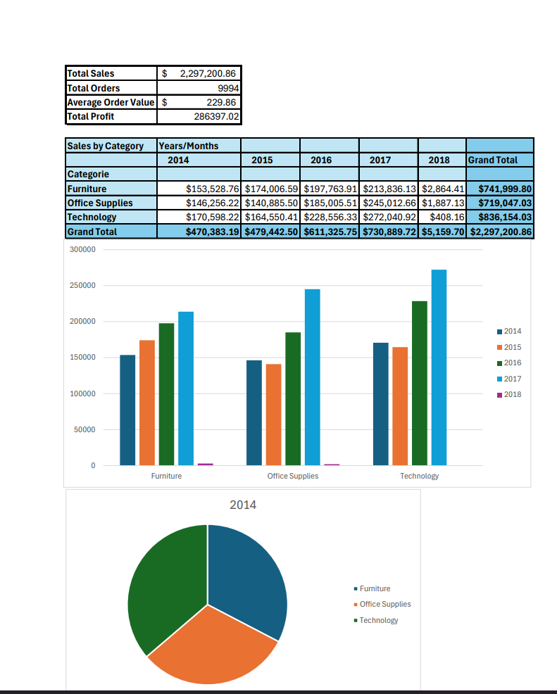

# Automated Sales Reporting in Excel VBA

## Overview
Automates the process of importing monthly sales CSVs, cleaning data, generating KPIs, building pivot tables & charts, and exporting a PDF summary — all in one click.

## Dataset
Sample Superstore dataset (modified to monthly CSVs)  
[Source: Kaggle / Tableau Public]([link-here](https://www.kaggle.com/datasets/vivek468/superstore-dataset-final))

## Features
- Import & merge all CSVs from a folder
- Remove duplicates, standardize dates
- Build KPIs: Total Sales, Orders, AOV, Profit
- Generate two pivot tables & charts (Category x Month, Region x Month)
- Export a PDF report

## Demo
**Dashboard view:**

## How to Run
1. Place monthly CSVs into `/data/raw`
2. Open `excel/automation.xlsm` in Excel Desktop
3. Enable macros
4. Press the `Generate Report` button (runs the macro)
5. View the updated Summary sheet or the exported PDF in `/reports/`

## Tech
- Microsoft Excel (VBA macros, pivot tables, charts)
- Windows/macOS

## Author
Batyrali Bazar
